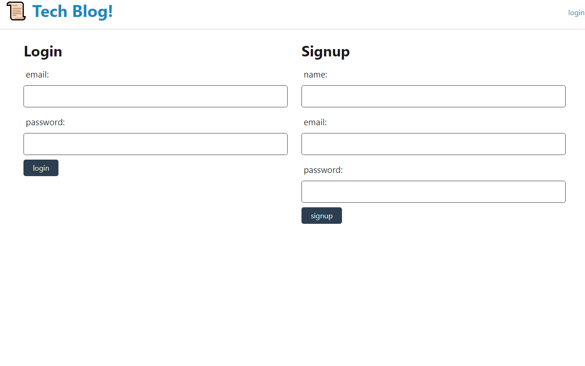

# tech-blog

## Description

Full-stack web application that utilizes user authentication and allows users to write posts that can be viewed by other viewers. Posts can be deleted and commented on by other users as well.

## Table of Contents

- [Installation Instructions](#Installation-Instructions)
- [Usage Information](#Usage-Information)
- [Links](#links)

## Usage Information

First time users must fill out the sign up form and then login with their newly created login email and password. You will be redirected to your profile page where you can write a post and view all of your previously written posts. Logout when you are finished. To view all users' posts, click on the home link in the top left 'Tech Blog'. You can then click on individual posts to comment on them.

## Links

[Application](https://boiling-bastion-61605.herokuapp.com/)  
 [GitHub](https://github.com/zachraab/tech-blog)
